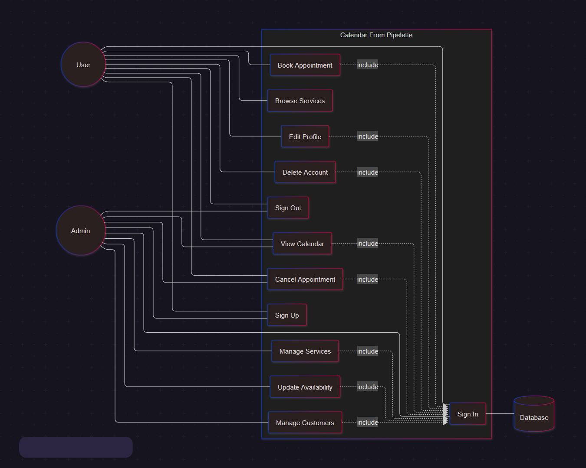
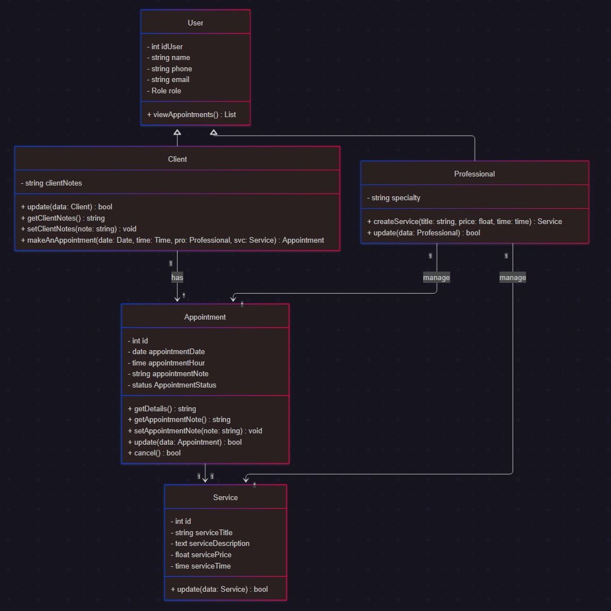
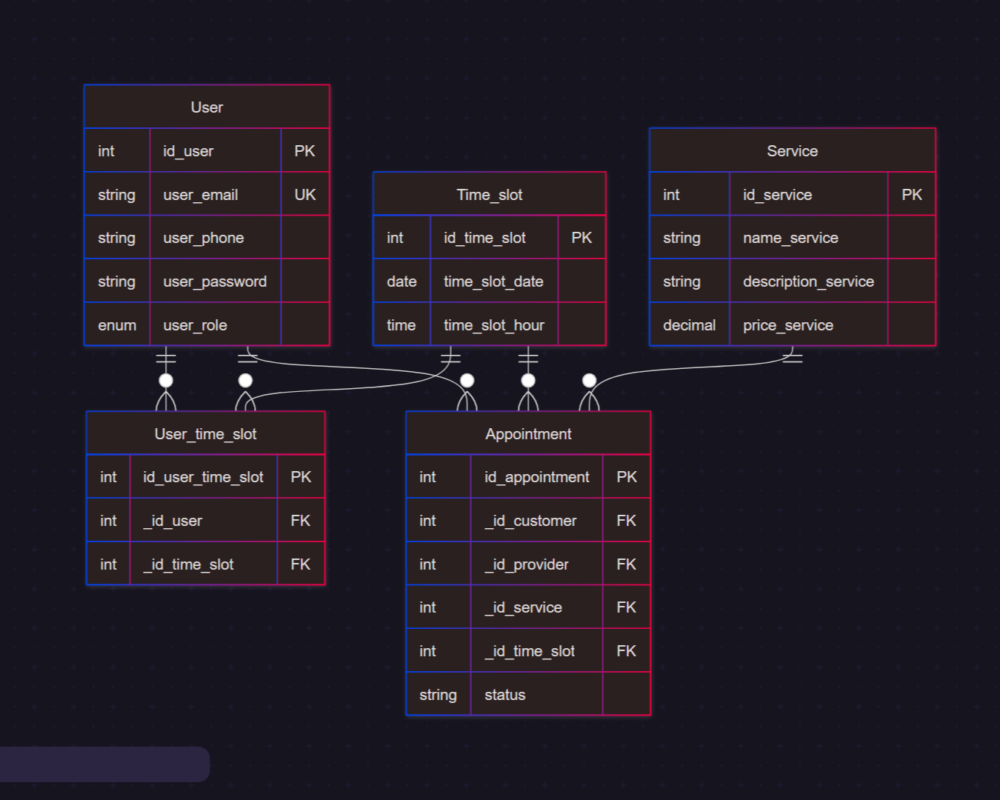
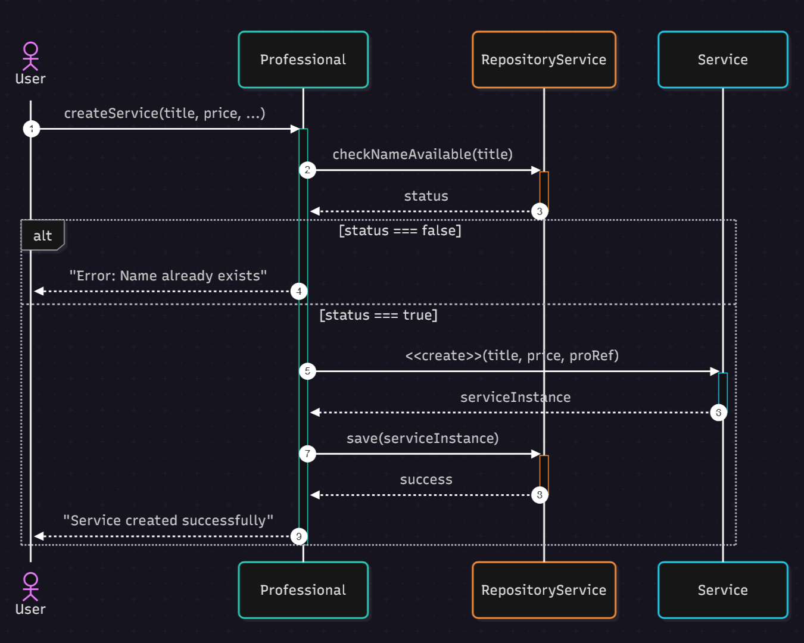
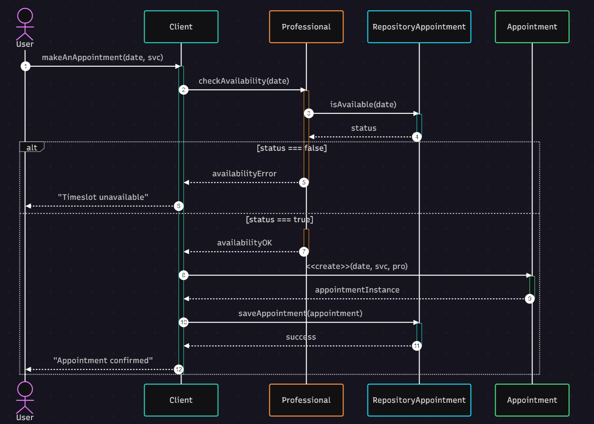

# 📅 Calendar-Manager

> **Statut du projet :** Phase de conception architecturale terminée 🏗️ / Début du développement.

Application de gestion de calendrier et de prise de rendez-vous conçue pour répondre aux besoins des petites structures. Le projet permet d'automatiser l'organisation des créneaux et de fluidifier la relation client.

---

## 📐 Conception & Architecture (UML)

La phase de modélisation a été une étape clé pour garantir une base technique robuste. L'utilisation de l'UML permet d'anticiper la logique métier et de structurer efficacement la base de données.

### 1. Analyse des besoins (Use Case)
Le diagramme de cas d'utilisation définit les interactions entre les acteurs (Client, Employé, Administrateur).

### 2. Modélisation des données (Class & ER Diagram)
Cette étape définit la structure des entités (Utilisateurs, Entreprises, Créneaux) et leurs relations logiques et physiques.

**Diagramme de Classe :**

**Diagramme ER (Modèle Relationnel) :**

### 3. Logique métier (Diagrammes de Séquence)
Modélisation des flux d'exécution pour les fonctionnalités critiques comme la prise de rendez-vous ou la gestion des absences.

**Processus de réservation :**

**Gestion des flux secondaires :**

---

## 🛠️ Stack Technique prévue

* **Conception :** UML (Modélisation structurée).
* **Front-end :** React (Bibliothèque JavaScript pour des interfaces dynamiques et composables).
* **Back-end :** Node.js (Architecture MVC et Programmation Orientée Objet - POO).
* **Base de données :** MySQL.
* **Infrastructure :** Docker & Docker Compose.

---

**Développé par Hugo Delsol** *Projet en cours de réalisation*
